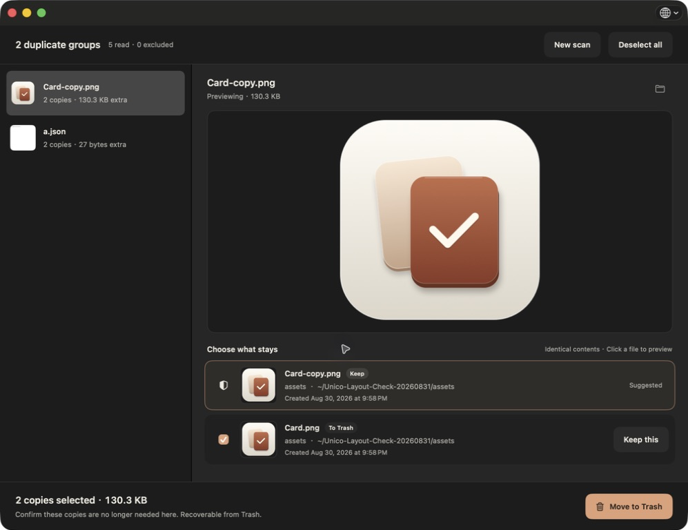

# Unico

**English** | [简体中文](README.zh-CN.md)


**[Download Unico v1.1.3 DMG](https://github.com/leowyleo/unico/releases/download/v1.1.3/Unico-v1.1.3-macOS-universal.dmg)** · [Install guide](#install) · [Report an issue](https://github.com/leowyleo/unico/issues/new)

Unico is a free, open-source duplicate-file finder for macOS. Find identical files, see what they are, and decide which copy stays.

> A little less. A little lighter.

Choose folders → review duplicate groups → keep a copy → confirm Move to Trash.

Everything runs on your Mac. No account, cloud upload, subscription, or background monitoring.

## See what stays



*Real app screenshot using generated sample files, not personal data.*

- **Exact duplicates.** File sizes and SHA-256 narrow the search; byte-for-byte comparison confirms identical content. Matching names alone do not count.
- **Your choice of scope.** Drop one or more folders, or scan the internal disk. Folder scans include subfolders and compare across selected locations.
- **Preview before cleanup.** Thumbnails, Quick Look previews, paths and creation dates help you choose. Files without a supported preview retain their file icon.
- **A clear default.** Keep the most recently modified copy by default, choose the earliest modified copy or decide manually, then change any group before cleanup. A suggestion is not a claim about which file is the original.
- **Trash, not permanent deletion.** Unico checks file identity and contents again before cleanup and keeps at least one copy in every group.
- **A quiet native interface.** English by default, with instant Simplified Chinese switching from the globe in the title bar. Follows the Mac's light or dark appearance.

## Know your scan scope

**Internal-disk scans** skip hidden folders, system locations, app internals, recognized development projects, libraries and unknown file types. External and network disks are not included automatically.

**Folders you select explicitly take priority over default exclusions, after a warning and confirmation.** The confirmed scope includes hidden files, app/project contents, executables and unknown types inside those folders. This permission applies only to that scan; it never carries into internal-disk scans.

**Identical contents do not make every path disposable.** Removing app, project or system files can break functionality. Confirm those copies are no longer needed at their locations. Unico still skips symbolic links, hard links, inaccessible items and cloud files not downloaded locally; it does not elevate privileges.

Moving files to Trash does not immediately free disk space. APFS clones and compression also mean the displayed file size may differ from actual space recovered. Unico does not empty Trash.

## Install

1. Download `Unico-v1.1.3-macOS-universal.dmg` from the [v1.1.3 release](https://github.com/leowyleo/unico/releases/tag/v1.1.3).
2. Double-click the DMG, then drag `Unico.app` to the `Applications` shortcut. The ZIP remains available as a fallback.
3. Open Unico. The community build is **ad-hoc signed, not Developer ID signed, and not notarized by Apple**. If macOS blocks it, review the app-specific approval in **System Settings → Privacy & Security** (on macOS 12: **System Preferences → Security & Privacy → General**). Only approve a download you trust. Do not disable Gatekeeper globally.
4. Start with a folder whose contents you recognize. Review the scope warning before scanning and the cleanup confirmation before moving anything.

The release includes `SHA256SUMS-dmg.txt` for the DMG. The existing `SHA256SUMS.txt` continues to verify the ZIP fallback; use `shasum -a 256` to check either download.

## Compatibility

- Minimum deployment target: **macOS 12 Monterey**.
- Universal binary: **Apple Silicon + Intel**.
- Runtime and UI checks performed on Apple Silicon / macOS 26.5.1. macOS 12/13 and Intel hardware have **not yet been tested in person**.
- This is an early community release. Keep a backup of important files.

## Build and test

Requires a Swift 6 toolchain on a host supported by that toolchain. Building uses Apple Command Line Tools; the documented test command uses a full Xcode installation. Unico has no third-party package dependencies.

```sh
git clone https://github.com/leowyleo/unico.git
cd unico
DEVELOPER_DIR=/Applications/Xcode.app/Contents/Developer swift test --scratch-path .build-tests
zsh scripts/package.sh
open dist/Unico.app
```

`package.sh` builds arm64 and x86_64 with a macOS 12.0 deployment target, combines them into a universal executable, ad-hoc signs the bundle, and creates versioned ZIP and DMG installers in `dist/`. The DMG includes an `Applications` shortcut for drag-to-install; the unversioned `Unico-macOS.zip` is kept for local compatibility.

The tests create their own fixtures. Trash-and-recovery tests move only generated sample files, never user-selected files.

## Project status

MIT licensed. Exact-file duplicate detection is available now. Similar-image matching is planned for a later version and is **not included** in this release.

[Product scope](docs/PRODUCT.zh-CN.md) · [Validation and limitations](docs/ACCEPTANCE.md) · [Release notes](docs/RELEASE_NOTES_v1.1.3.md) · [Media kit and draft copy](docs/promo/CHANNEL_COPY.md)
