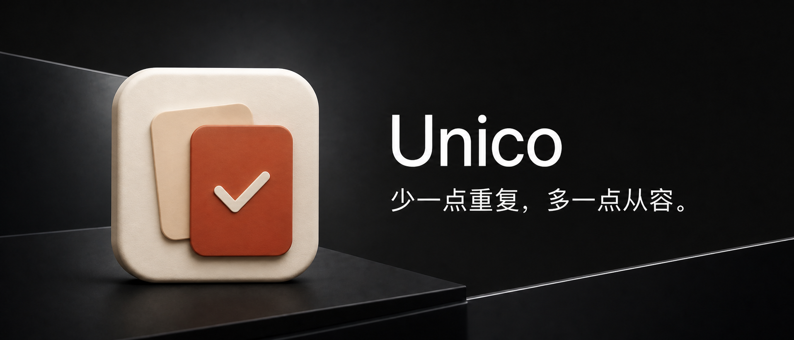

# Unico

[English](README.md) | **简体中文**



**[下载 Unico v1.1.3 DMG](https://github.com/leowyleo/unico/releases/download/v1.1.3/Unico-v1.1.3-macOS-universal.dmg)** · [安装说明](#安装) · [反馈问题](https://github.com/leowyleo/unico/issues/new)

Unico 是一个免费开源的 macOS 重复文件查找工具。找出完全相同的文件，看清楚，再决定留下哪一份。

> 少一点重复，多一点从容。

选择文件夹 → 查看重复组 → 决定保留项 → 确认移到废纸篓。

完全在本机运行。无需账号，不上传文件，没有订阅，也不会后台监控你的文件。

## 看清楚，再清理


*亮色主题下的真实 App 截图，展示重复组、文件预览与保留项。*

- **只认内容完全相同。** 先按大小和 SHA-256 筛选，再逐字节比较，不凭文件名判断重复。
- **扫哪里，由你决定。** 拖入一个或多个文件夹，包含子目录、跨目录比较；也可扫描本机内置磁盘。
- **直接预览。** 缩略图、Quick Look、路径与创建时间放在一起；无法预览的类型显示文件图标。
- **自动建议保留一份。** 默认保留最新修改日期的文件；也可改为保留最早修改日期，或不预选清理、手动决定。“推荐保留”不等于认定它是原件。
- **只移到废纸篓。** 清理前再次核验文件身份和内容，每组至少保留一份，不提供永久删除或清空废纸篓。
- **克制的原生界面。** 默认英文，标题栏地球图标可即时切换简体中文；明亮配色呼应 Unico 封面。

## 两种扫描范围

**全盘扫描**按设置中的文件类型查找多媒体、文档表格与代码脚本；系统位置、隐藏项、应用包、链接、依赖与缓存始终跳过，不自动包含外接与网络磁盘。

**用户主动选择文件夹后仍需确认扫描范围。** 设置中的“系统与未知文件（高风险）”默认关闭；即使开启，系统位置、应用包、链接、隐藏项、依赖与缓存仍不会参与比较。

**内容相同，不代表所有位置的文件都可以删。** 删除应用、项目或系统资源可能导致功能失效，请确认这些位置的副本不再需要。符号链接、硬链接、无权限内容及尚未下载到本机的云文件仍会跳过；Unico 不自动提权。

移到废纸篓不代表马上释放空间。APFS 克隆、压缩等也会影响实际回收空间，因此显示的文件总大小不等于承诺释放的磁盘空间。

## 安装

1. 从 [v1.1.3 Release](https://github.com/leowyleo/unico/releases/tag/v1.1.3) 下载 `Unico-v1.1.3-macOS-universal.dmg`。
2. 双击打开 DMG，将 `Unico.app` 拖入“应用程序”快捷入口。ZIP 仍保留作为备用下载。
3. 当前社区版使用**临时签名，没有 Developer ID 签名，也尚未通过 Apple 公证**。若首次启动被拦截，请在“系统设置 → 隐私与安全性”中查看针对该 App 的允许操作；macOS 12 对应“系统偏好设置 → 安全性与隐私 → 通用”。只允许你信任的下载，不要全局关闭 Gatekeeper。
4. 建议先用内容熟悉的文件夹试扫。扫描范围与实际清理分别确认。

Release 附带 `SHA256SUMS-dmg.txt`，可使用 `shasum -a 256` 核对 DMG；原有 `SHA256SUMS.txt` 继续用于校验 ZIP 备用包。

## 兼容性

- 最低运行目标：**macOS 12 Monterey**。
- 通用安装包：**Apple 芯片 + Intel**。
- 已在 Apple Silicon / macOS 26.5.1 实测；macOS 12/13 与 Intel 实机**仍待验证**，不把交叉编译当作实机验收。
- 这是早期社区版本，重要文件请保留备份。

## 构建与测试

开发需要 Swift 6 工具链及其支持的主机系统。构建可使用 Apple Command Line Tools；下方测试命令使用完整 Xcode。项目无第三方包依赖。

```sh
git clone https://github.com/leowyleo/unico.git
cd unico
DEVELOPER_DIR=/Applications/Xcode.app/Contents/Developer swift test --scratch-path .build-tests
zsh scripts/package.sh
open dist/Unico.app
```

脚本分别按 macOS 12.0 目标构建 arm64 和 x86_64，合并、临时签名并在 `dist/` 生成带版本号的 ZIP 与 DMG 安装包。DMG 内含“应用程序”快捷入口，支持拖拽安装；同时保留未带版本号的 `Unico-macOS.zip` 供本地脚本兼容使用。测试只使用自行生成的样本，废纸篓恢复测试不会处理用户文件。

## 项目状态

采用 [MIT License](LICENSE) 开源。当前免费提供完全重复文件查找；相似图片查找留待后续版本，本版尚未实现。

[产品范围](docs/PRODUCT.zh-CN.md) · [验收与限制](docs/ACCEPTANCE.md) · [版本说明](docs/RELEASE_NOTES_v1.1.3.md) · [宣传素材与文案草稿](docs/promo/CHANNEL_COPY.md)
