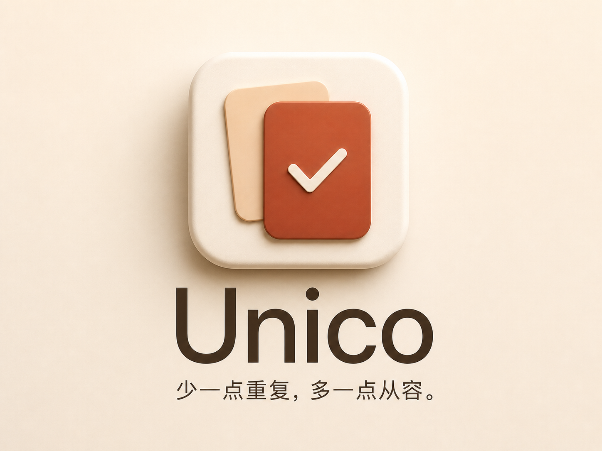

# 重复文件，留一份就好：我做了一个免费的 Mac 工具 Unico

> 同一张图片保存了几次，真正让人犹豫的不是删不删，而是不知道哪一份该留。

整理 Mac 文件时，我经常遇到这样的情况：图片从下载目录存过一次，又从聊天里保存过一次；项目归档时，换个文件夹再复制一份。文件名可能不同，位置也不一样，时间久了就很难判断它们是不是同一份。

想清理，又不敢直接删。内容真的一样吗？删掉其中一份，会不会影响某个应用或项目？

做完截图工具 Clip，这次我做了 Unico：一个免费开源的 macOS 重复文件查找工具。它先把重复文件找出来，让你预览、比较路径，再决定哪一份留下。

## 先比较内容，再谈清理

Unico 不根据文件名判断重复，而是先按文件大小和 SHA-256 缩小范围，再逐字节比较文件内容。只有内容完全相同，才会被放进同一组。

你可以选择一个文件夹，也可以同时加入下载、桌面和归档目录，跨目录比较；还可以扫描本机内置磁盘。全盘扫描范围更大，耗时也会更久。

当前版本只查找完全重复的文件。两张看起来相似的图片，不会被自动当成同一份；相似图片查找留到后续再考虑。

## 看清楚，再决定留哪一份

找到重复组后，点击文件可以查看缩略图、Quick Look、文件名、路径和创建时间。

Unico 默认推荐保留创建时间较早的一份，但“推荐保留”不等于认定它就是原件。你可以换一份保留，也可以取消某个副本的清理。

真正执行前，Unico 会再次核验文件身份和内容，每组至少留下一份。多余副本只会移到废纸篓，不会永久删除，也不会清空废纸篓。

这个顺序很简单：**选范围 → 看预览 → 决定保留项 → 确认清理。**

## 内容相同，也不代表每个位置都能删

应用、项目或系统资源可能在不同路径各自需要一份相同内容。全盘扫描默认跳过系统、应用内部和已识别的开发项目等位置；如果你主动选择某个文件夹并确认风险，可以覆盖默认排除规则，但这不等于其中的文件都适合删除。

拿不准的，先留着。移入废纸篓也不会立刻释放等量空间，APFS 克隆和压缩都会影响实际回收空间。

## 安装与下载

Unico 完全在本机运行，无账号、不上传文件、没有订阅，也不会后台监控文件。默认英文，可以在标题栏切换简体中文。

下载 [Unico v1.1.3 DMG](https://github.com/leowyleo/unico/releases/tag/v1.1.3)，双击打开后，把 `Unico.app` 拖入“应用程序”。安装包同时支持 Apple 芯片和 Intel，最低目标为 macOS 12；ZIP 备用包也保留在 Release 中。

当前社区版使用临时签名，没有 Developer ID 签名，也没有通过 Apple 公证。首次打开如果出现 macOS 提示，请按系统说明处理，不要为了启动应用而全局关闭安全保护。重要文件请先保留备份。

项目已在 GitHub 开源，欢迎反馈真正让你不敢点“清理”的那一步：

https://github.com/leowyleo/unico

少一点重复，多一点从容。
